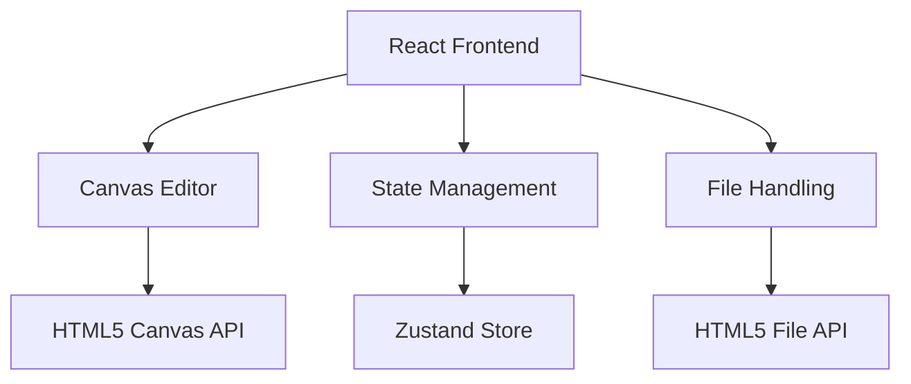

## 1. Architecture Design



## 2. Technology Description
- **Frontend**: React@18 + TypeScript + TailwindCSS@3 + Vite
- **Initialization Tool**: vite-init
- **Canvas Library**: Fabric.js (用于简化Canvas操作)
- **State Management**: Zustand
- **Routing**: React Router DOM

## 3. Route Definitions
| Route | Purpose |
|-------|---------|
| / | 首页/上传页面 |
| /editor | 主图编辑器 |
| /export | 预览导出页面 |

## 4. Data Model
### 4.1 State Definition
```typescript
interface EditorState {
  productImage: string | null;
  currentTemplate: Template | null;
  textElements: TextElement[];
  stickerElements: StickerElement[];
  background: {
    type: 'solid' | 'gradient';
    color: string;
    gradient?: string;
  };
}

interface Template {
  id: string;
  name: string;
  thumbnail: string;
  layout: LayoutConfig;
}

interface TextElement {
  id: string;
  text: string;
  x: number;
  y: number;
  fontSize: number;
  fontFamily: string;
  color: string;
}

interface StickerElement {
  id: string;
  type: string;
  x: number;
  y: number;
  scale: number;
}
```

### 4.2 Preset Templates
```typescript
const TEMPLATES: Template[] = [
  {
    id: 'simple',
    name: '简约风格',
    layout: { productImageScale: 0.7, textPosition: 'bottom' }
  },
  {
    id: 'bold',
    name: '醒目风格',
    layout: { productImageScale: 0.5, textPosition: 'top' }
  }
];
```

## 5. Core Module Design

### 5.1 Canvas Editor Component
- 负责渲染产品图片、文字、贴纸
- 提供拖拽、缩放、旋转功能
- 实时更新画布内容

### 5.2 Template Service
- 管理预设模板
- 应用模板到编辑器

### 5.3 Export Service
- 将Canvas内容转换为图片
- 支持多种尺寸导出
- 提供下载功能

## 6. File Structure
```
/workspace
  /src
    /components
      EditorCanvas.tsx
      Toolbar.tsx
      TemplateGallery.tsx
    /pages
      UploadPage.tsx
      EditorPage.tsx
      ExportPage.tsx
    /store
      editorStore.ts
    /utils
      canvasUtils.ts
      exportUtils.ts
    App.tsx
    main.tsx
```
