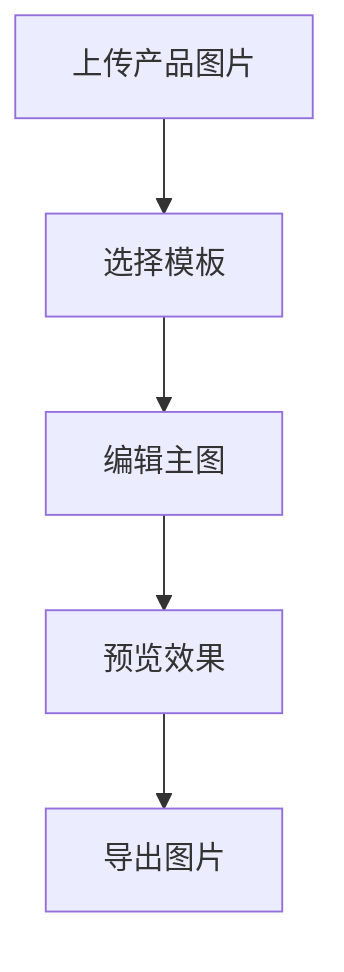

## 1. Product Overview
亚马逊主图自动生成工具，帮助卖家快速创建符合亚马逊规范的产品主图。
- 主要解决卖家需要专业设计软件才能制作主图的问题，降低视觉门槛
- 目标用户是亚马逊卖家、电商运营人员

## 2. Core Features

### 2.1 Feature Module
1. **图片上传页**：产品图片上传、模板选择
2. **主图编辑器**：文字添加、贴纸、颜色调整、布局设置
3. **预览导出页**：多尺寸预览、一键导出亚马逊标准尺寸

### 2.3 Page Details
| Page Name | Module Name | Feature description |
|-----------|-------------|---------------------|
| 图片上传页 | 图片上传 | 支持拖拽上传产品图片，支持JPG/PNG格式 |
| 图片上传页 | 模板库 | 预设多种亚马逊主图模板，分类展示 |
| 主图编辑器 | 文字工具 | 添加产品标题、卖点文字，支持字体、颜色、大小调整 |
| 主图编辑器 | 贴纸装饰 | 添加常见图标、标签（如爆款、折扣） |
| 主图编辑器 | 背景调整 | 纯色/渐变背景，支持颜色选择 |
| 预览导出页 | 实时预览 | 多设备尺寸预览 |
| 预览导出页 | 一键导出 | 导出亚马逊标准尺寸（1000x1000px, 1500x1500px） |

## 3. Core Process
用户上传产品图片 → 选择预设模板 → 在编辑器中调整文字、贴纸、背景 → 预览效果 → 导出符合亚马逊规范的主图

## 4. User Interface Design
### 4.1 Design Style
- **主色调**：橙色 (#FF9900) + 深灰 (#232F3E) - 呼应亚马逊品牌色系
- **次要色**：浅蓝色 (#007185)
- **按钮风格**：圆角矩形，悬停有轻微上浮效果
- **字体**：标题使用 'Poppins'，正文使用 'Inter'
- **布局风格**：卡片式布局，清晰的区域分隔
- **图标风格**：线性图标，简洁现代

### 4.2 Page Design Overview
| Page Name | Module Name | UI Elements |
|-----------|-------------|-------------|
| 图片上传页 | 上传区域 | 虚线边框区域，拖拽上传动画 |
| 主图编辑器 | 编辑画布 | 居中展示，周围工具栏环绕 |
| 主图编辑器 | 工具栏 | 垂直排列在左侧，图标+文字 |
| 预览导出页 | 预览区 | 设备框架展示，可切换尺寸 |

### 4.3 Responsiveness
- 桌面端为主，支持平板适配
- 工具栏在移动端可折叠收起

### 4.4 交互设计
- 平滑的页面过渡动画
- 拖拽上传的视觉反馈
- 编辑工具的即时预览
