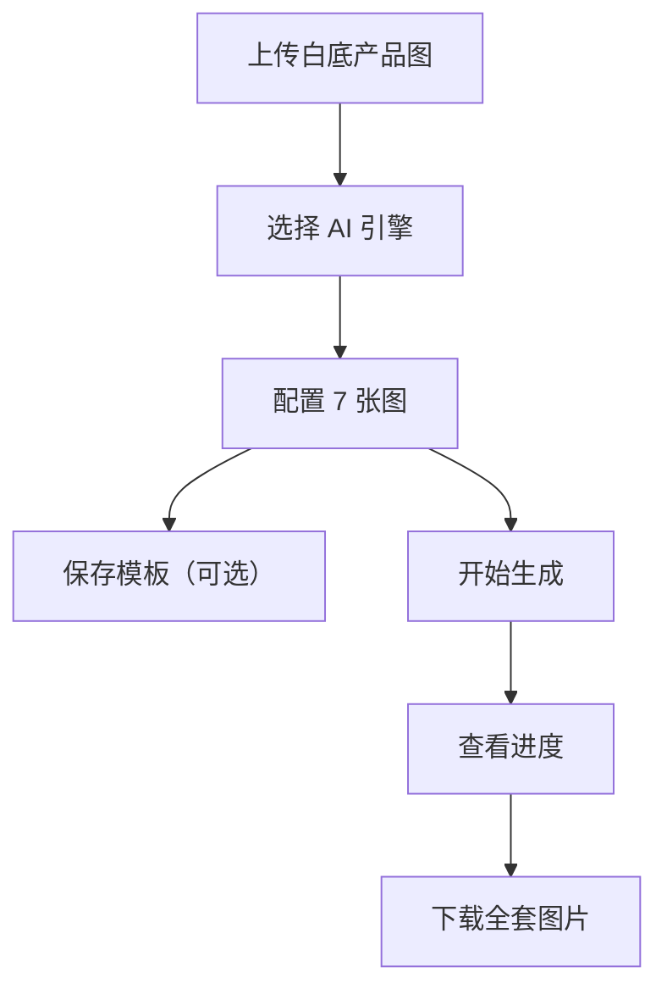

## 1. Product Overview
亚马逊主图自动生成工具，帮助卖家通过 AI 快速创建一整套（7张）符合亚马逊规范的产品展示图片。
- 主要解决卖家需要专业设计技能和大量时间才能制作套图的问题
- 目标用户是亚马逊卖家、电商运营人员

## 2. Core Features

### 2.1 Feature Module
1. **产品图上传**：白底产品图片上传
2. **AI 引擎选择**：支持多种 AI 图像生成引擎
3. **7图批量配置**：每张图可单独设置参考图和提示词
4. **模板管理**：保存/加载配置模板
5. **队列生成**：逐张生成，显示进度，支持暂停
6. **历史记录**：查看和管理历史生成记录
7. **打包导出**：一键下载全套图片

### 2.3 Page Details
| Page Name | Module Name | Feature description |
|-----------|-------------|---------------------|
| 首页 | 产品图上传 | 支持拖拽上传产品图片，支持 JPG/PNG 格式 |
| 首页 | AI 引擎选择 | 选择 Stable Diffusion、DALL-E、Gemini、豆包等引擎 |
| 首页 | 7图配置 | 为每张图设置参考图和提示词 |
| 首页 | 生成控制 | 开始、暂停、重置、下载功能 |
| 模板管理 | 模板系统 | 保存、加载、删除配置模板 |
| 历史记录 | 历史管理 | 查看、删除历史生成记录 |
| 设置 | API 密钥配置 | 配置各 AI 服务的 API 密钥 |

## 3. Core Process
用户上传白底产品图 → 选择 AI 引擎 → 配置 7 张图的提示词和参考图 → （可选）保存为模板 → 开始生成 → 查看进度 → 下载全套图片

## 4. User Interface Design
### 4.1 Design Style
- **主色调**：橙色 (#FF9900) + 深灰 (#232F3E) - 呼应亚马逊品牌色系
- **次要色**：蓝色 (#007185)
- **按钮风格**：圆角矩形，悬停有轻微反馈
- **字体**：使用系统默认字体，清晰易读
- **布局风格**：卡片式布局，清晰的区域分隔
- **图标风格**：使用 Lucide React 线性图标，简洁现代

### 4.2 Page Design Overview
| Page Name | Module Name | UI Elements |
|-----------|-------------|-------------|
| 首页 | 顶部导航 | Logo、历史记录、模板管理、设置按钮 |
| 首页 | 左侧栏 | 产品图上传、AI 引擎选择 |
| 首页 | 主内容区 | 7 个配置卡片、生成控制按钮、进度条 |
| 历史记录 | 历史列表 | 历史记录卡片，支持查看和删除 |
| 模板管理 | 模板列表 | 模板卡片，支持加载、删除 |
| 设置 | API 配置 | 各 AI 服务的 API 密钥输入框 |

### 4.3 Responsiveness
- 桌面端为主，支持平板适配
- 响应式布局，自适应屏幕尺寸
